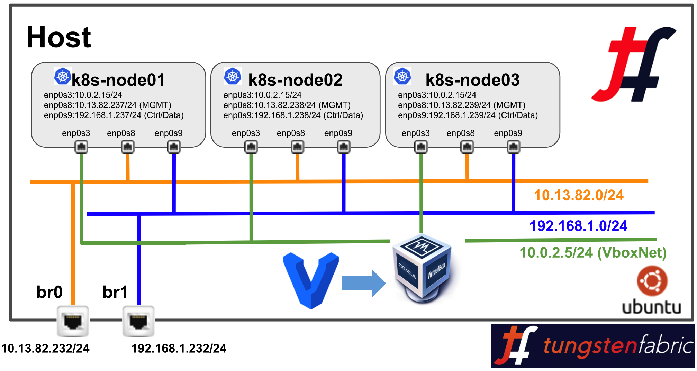

# Tungsten Fabric OpenStack Helm Deployment via Vagrant


### Tested with:

* Ubuntu: 16.0.43
* Kernel: 4.4.0-112-generic
* Vagrant: 2.0.1
* Ansible: 2.4.3
* VirtualBox: 5.2

## Vagrant OSH and TF Multi-node setup Instructions:




1. Prepare Ubuntu 16.0.4.3 Host and install git, vagrant, ansible and virtulabox.

2. Also install linux bridge utility and configure bridge as per above diagram. Here is how it looks in my setup:

```bash
# brctl show
bridge name     bridge id               STP enabled     interfaces
br0             8000.2c44fd99bd78       no              em1
br1             8000.ac162d9ef574       no              p1p1
docker0         8000.02422c8f421e       no
```

3. Git Clone the repo and make changes in "servers.yaml" if you would like to change VM names, IP addresses and vagrnat box related detail.

```bash
host-bms> git clone https://github.com/qarham/tf-osh-vagrant.git
host-bms> cd tf-osh-vagrant
host-bms> vagrant status

Note: Want to change VM naes and IP addresses edit following file as needed:

host-bms> cat servers.yaml
---
- name: k8s-node01
  box: Ubuntu-16.04-250G
  ram: 32768
  cpus: 4
  ip-mgmt: 10.13.82.237
  ip-control-data: 192.168.1.237

- name: k8s-node02
  box: Ubuntu-16.04-250G
  ram: 32768
  cpus: 4
  ip-mgmt: 10.13.82.238
  ip-control-data: 192.168.1.238

- name: k8s-node03
  box: Ubuntu-16.04-250G
  ram: 32768
  cpus: 4
  ip-mgmt: 10.13.82.239
  ip-control-data: 192.168.1.239

```

4. If you don't want to make a change and want setup in your host as per topology diagram just following below steps to bring the clsuter up.

```bash
To bring the VMs up only with Vagrant Box name "Ubuntu-16.04-250G":
host-bms> vagrant up

Start OpenStack Helm provisioning:
host-bms> vagrant provision --provision-with OSH-Install

Start Tunsten Fabric provisioning:
host-bms> vagrant provision --provision-with TF-Install
```

5. Once all above commands are sucessful without any ***"error"*** check status of the pods by connecting to "ks8-node01"

```bash
k8s-node01> kubectle get pods -n ceph
k8s-node01> kubectle get pods -n openstack
k8s-node01> kubectle get pods -n contrail

& Helm
k8s-node01> helm ls
```

6. Now clsuter is ready for basic testing use following steps for Virtual Network and Virtual Machine creation.

```bash
k8s-node01> export OS_CLOUD=openstack_helm

k8s-node01> openstack network create MGMT-VN
k8s-node01> openstack subnet create --subnet-range 172.16.1.0/24 --network MGMT-VN MGMT-VN-subnet

k8s-node01> openstack server create --flavor m1.tiny --image 'Cirros 0.3.5 64-bit' \
--nic net-id=MGMT-VN \
Test-01

(k8s-node01)> openstack server create --flavor m1.tiny --image 'Cirros 0.3.5 64-bit' \
--nic net-id=MGMT-VN \
Test-02
```

### Reference

* <https://github.com/Juniper/openstack-helm/blob/master/doc/source/install/multinode.rst>


* <https://github.com/Juniper/contrail-helm-deployer/tree/master/doc>

* <https://github.com/deepak-dt/openstack-helm-opencontail-heat>