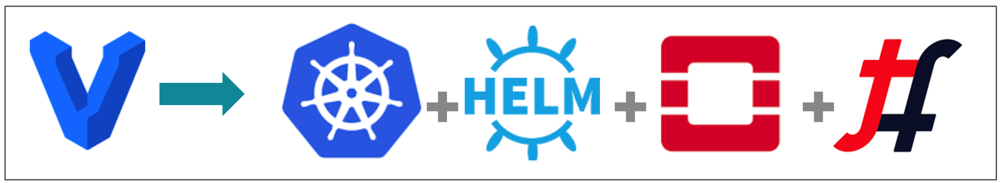
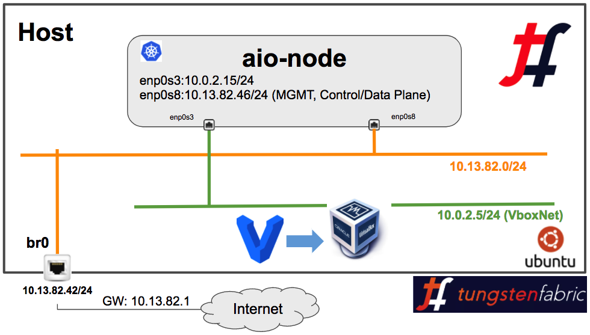

#  AIO Tungsten Fabric OpenStack Helm Deployment via Vagrant



## Tested with

* Ubuntu: 16.04.3
* Kernel: 4.4.0-112-generic
* Vagrant: 2.0.1
* Ansible: 2.4.3
* VirtualBox: 5.2
* Vagrant Box: 250GB size

### AIO Vagrant OSH and TF AIO setup Instructions



Here are AIO Tungsten Fabric OSH setup instructions:

1. Git clone the repo and update AIO VM IP addresses as per your environment. My setup diagram and bridge "br0" config is captured in the above diagram.

```bash
vagrant-host> git clone https://github.com/qarham/tf-osh-vagrant.git
vagrant-host> cd aio
vagrant-host> vi Vagrantfile ## Change IP address as per your environment

vagrant-host> vagrant up
```

2. Once all above commands are sucessful without any ***"error"*** please check status of the pods by connecting to the "aio-node" VM using following commands.

```bash
vagrant-host> vagrant ssh aio-node

aio-node> kubectl get pods -n ceph
aio-node> kubectl get pods -n openstack
aio-node> kubectl get pods -n contrail

& for Helm
aio-node> helm ls
```

3. Now clsuter is ready for basic testing use following steps for Virtual Network and Virtual Machines creation.

```bash
aio-node> export OS_CLOUD=openstack_helm

aio-node> openstack network create MGMT-VN
aio-node> openstack subnet create --subnet-range 172.16.1.0/24 --network MGMT-VN MGMT-VN-subnet

aio-node> openstack server create --flavor m1.tiny --image 'Cirros 0.3.5 64-bit' \
--nic net-id=MGMT-VN \
Test-01

aio-node> openstack server create --flavor m1.tiny --image 'Cirros 0.3.5 64-bit' \
--nic net-id=MGMT-VN \
Test-02
```

### AIO TF OSH Quick demo:

[](https://asciinema.org/a/BLavxYKP7b4vOfFVhN5RjneYI)

### Reference

* <https://github.com/Juniper/openstack-helm/blob/master/doc/source/install/multinode.rst>

* <https://github.com/Juniper/contrail-helm-deployer/tree/master/doc>

* <https://github.com/deepak-dt/openstack-helm-opencontail-heat>